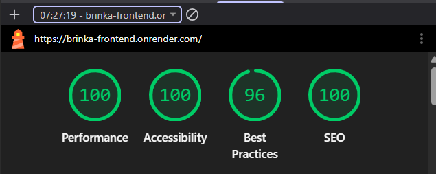
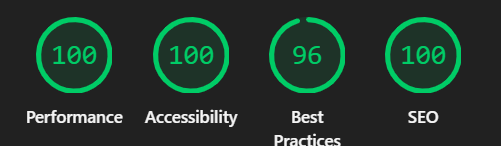
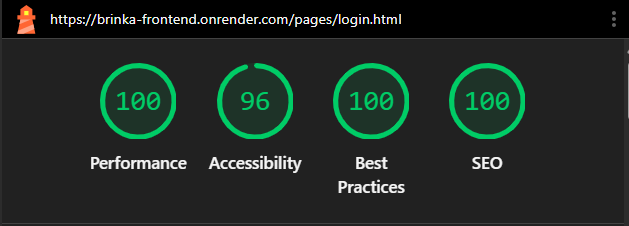
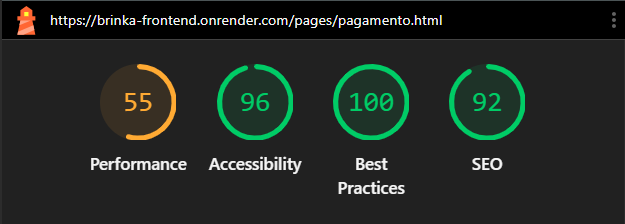

# Relatório Lighthouse — Brinka

Protocolo seguido conforme Seção 5.2 do documento do projeto:
- Chrome anônimo, sem extensões
- Categoria avaliada: Acessibilidade (demais categorias registradas também, para referência)
- Dispositivo: Desktop
- 3 execuções consecutivas por página — considera-se a **mediana**
- Páginas avaliadas: página principal + 1 página interna

> ✅ **Status:** 3 execuções consecutivas registradas em cada página, com resultados idênticos entre as rodadas. Mediana calculada abaixo.

---

## Página: Index (não logado) — `/`

URL: `https://brinka-frontend.onrender.com/`

| Execução | Data/Hora       | Performance | Accessibility | Best Practices | SEO |
|----------|-----------------|:-----------:|:--------------:|:---------------:|:---:|
| 1        | 12/08/2026 07:29 | 100 | 96 | 100 | 100 |
| 2        | 12/08/2026 07:29 | 100 | 96 | 100 | 100 |
| 3        | 12/08/2026 07:29 | 100 | 96 | 100 | 100 |
| **Mediana** | —            | **100** | **96** | **100** | **100** |

---

## Página: Login — `/pages/login.html`

URL: `https://brinka-frontend.onrender.com/pages/login.html`

| Execução | Data/Hora       | Performance | Accessibility | Best Practices | SEO |
|----------|-----------------|:-----------:|:--------------:|:---------------:|:---:|
| 1        | 12/08/2026 07:34 | 100 | 96 | 100 | 100 |
| 2        | 12/08/2026 07:34 | 100 | 96 | 100 | 100 |
| 3        | 12/08/2026 07:34 | 100 | 96 | 100 | 100 |
| **Mediana** | —            | **100** | **96** | **100** | **100** |

---

## Página: Index (logado) — `/`

URL: `https://brinka-frontend.onrender.com/`

| Execução | Data/Hora       | Performance | Accessibility | Best Practices | SEO |
|----------|-----------------|:-----------:|:--------------:|:---------------:|:---:|
| 1        | 12/08/2026 07:34 | 100 | 100 | 96 | 100 |
| 2        | 12/08/2026 07:34 | 100 | 100 | 96 | 100 |
| 3        | 12/08/2026 07:34 | 100 | 100 | 96 | 100 |
| **Mediana** | —            | **100** | **100** | **96** | **100** |

---

## Página: Pagamento — `/pages/pagamento.html`

URL: `https://brinka-frontend.onrender.com/pages/pagamento.html`

| Execução | Data/Hora       | Performance | Accessibility | Best Practices | SEO |
|----------|-----------------|:-----------:|:--------------:|:---------------:|:---:|
| 1        | 12/08/2026 08:19 | 55 | 96 | 100 | 92 |
| 2        | 12/08/2026 08:19 | 55 | 96 | 100 | 92 |
| 3        | 12/08/2026 08:19 | 55 | 96 | 100 | 92 |
| **Mediana** | —            | **55** | **96** | **100** | **92** |
---

## Evidências

As capturas de tela correspondentes a cada execução devem ser adicionadas na pasta `assets/` do repositório e referenciadas aqui, por exemplo:

## Checklist de conformidade (Seção 5.1)

- [ ] Imagens significativas com `alt` descritivo; decorativas com `alt=""`
- [ ] Contraste ≥ 4.5:1 (texto normal)
- [ ] Navegação completa por teclado (carrinho e checkout sem mouse)
- [ ] Foco visível em todos os elementos interativos
- [ ] HTML semântico (`header`, `nav`, `main`, `button`, `label`)
- [ ] Formulários com labels associados e erros acessíveis
- [ ] Nenhuma informação transmitida só por cor
- [ ] Zoom até 200% sem quebrar layout
- [ ] `lang="pt-BR"` no `html`
- [ ] Lighthouse Acessibilidade ≥ 90 (mediana das 3 execuções)